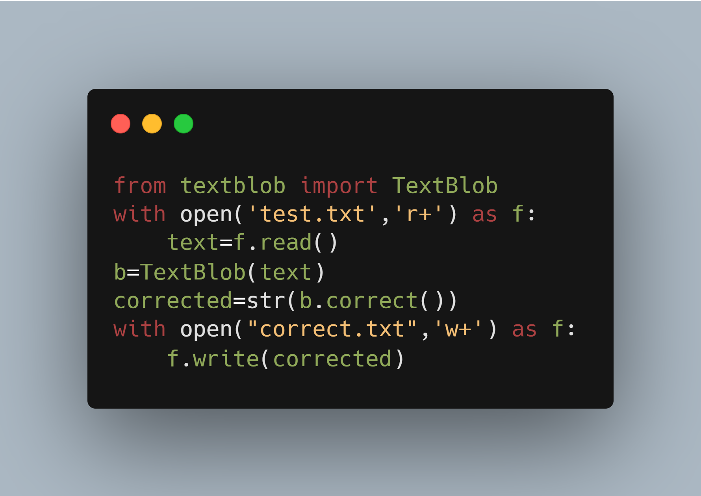

# Spell Corrector 

This is amazing python script using textblob library using python to correct the spellings in a text.  
Here text from a file is readed by the script and will correct the spellings using textblob library.  

Here is the carbon code of app.py

