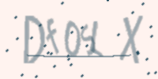
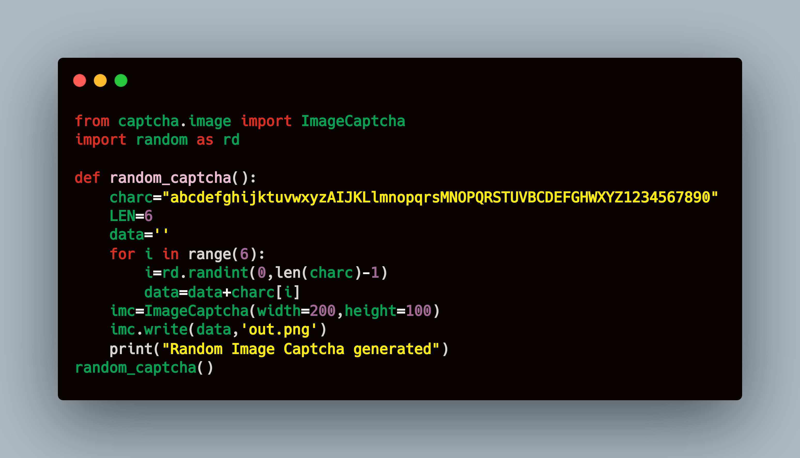

# Random Captcha Generator

  

This is a amazing python script which creates a random image captcha of 6 letters developed by using captcha library.  
The example of random image generated shown above  
Here is the Carbon code of random captcha generator:-  

